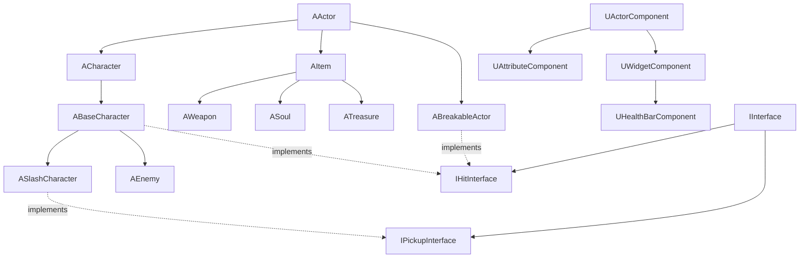
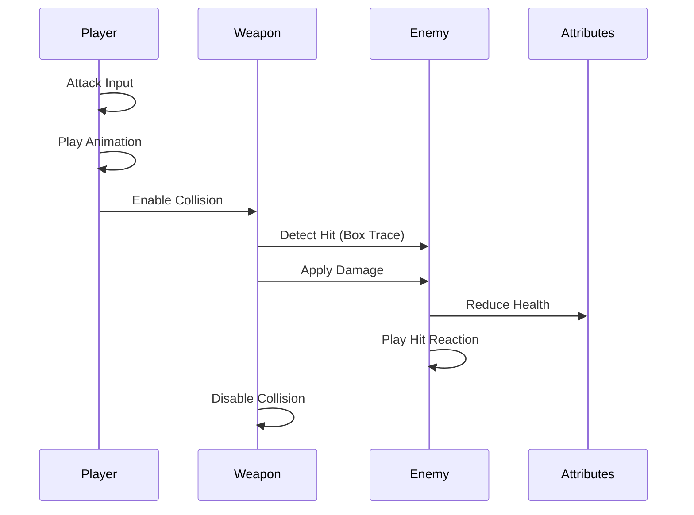
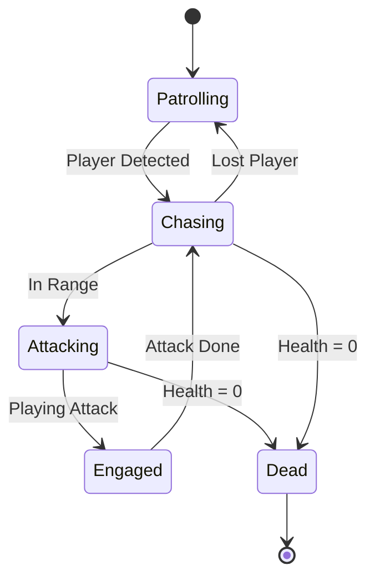

# Steel and Shadow

A third-person action RPG built with Unreal Engine 5. Think Dark Souls combat meets character progression systems—dodge, parry, collect souls, and fight intelligent AI enemies.


## What It Does

This is a souls-like combat game where timing matters. You've got stamina-based dodging with i-frames, melee combos, and enemies that actually hunt you down. Break stuff to get loot, collect souls for progression, and try not to die.

**Core Features:**
- Real-time combat with hit reactions and directional damage
- AI enemies with patrol/chase/attack behavior trees
- Stamina system for dodging (because button mashing shouldn't work)
- Inverse kinematics for realistic character movement
- Custom UI showing health, stamina, souls, and gold

## Architecture

The game follows a component-based design where everything inherits from a few base classes:

### Class Hierarchy



**BaseCharacter** handles combat for both player and enemies. **SlashCharacter** adds player input and equipment. **Enemy** gets AI behavior. Everything that can take damage implements `IHitInterface`, and anything you can pick up implements `IPickupInterface`.

### How Combat Works



When you attack, an animation notify turns on weapon collision. The weapon does a box trace to detect hits (more accurate than sphere collision), applies damage through Unreal's damage system, and the enemy reacts based on where you hit them—front, back, left, or right.

### Enemy AI States



Enemies patrol waypoints until they see you, then chase until they're close enough to attack. They use NavMesh pathfinding and have configurable aggro/attack ranges. Once they lose sight of you (or you run far enough), they go back to patrolling.

## Project Structure

```
Source/SteelAndShadow/
├── Characters/          # BaseCharacter, SlashCharacter, animations
├── Enemy/               # AI enemies with behavior trees
├── Components/          # AttributeComponent (health/stamina/resources)
├── Items/               # Weapons, souls, treasure
├── Interfaces/          # HitInterface, PickupInterface
├── HUD/                 # UI widgets and overlays
└── Breakable/           # Destructible objects
```

All gameplay code is in C++. Blueprints are used for asset setup and designer tweaks, but the core logic is here.

## Technical Stuff Worth Mentioning

**Animation:** Custom IK for foot placement, directional hit reactions, motion warping for attack positioning

**AI:** State machine with pawn sensing, NavMesh navigation, dynamic patrol points

**Combat:** Box trace collision (not sphere overlap), ignore lists to prevent double-hits, damage type system for future expansion

**UI:** Component-based health bars for enemies, main HUD overlay for player stats

**Performance:** Disabled tick on actors that don't need it, optimized collision channels, early exits in update loops

## Controls

| Action | Input |
|--------|-------|
| Move | WASD |
| Look | Mouse |
| Jump | Space |
| Attack | Left Click |
| Dodge | Right Click |
| Equip Weapon | E |

---

This is a learning project for Unreal Engine C++ and action RPG systems. Feel free to poke around the code—it's documented.
