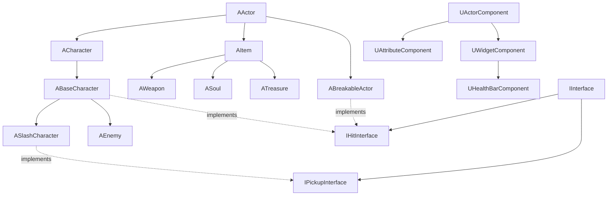
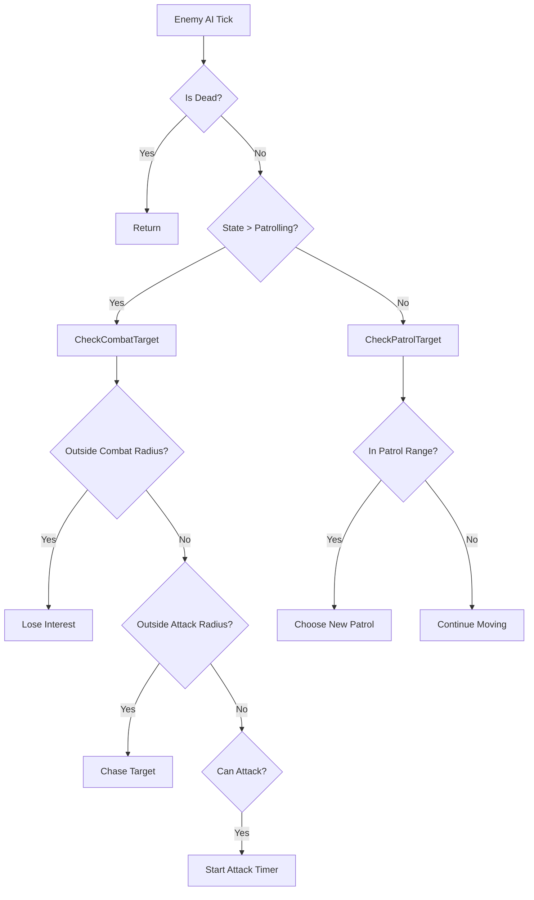
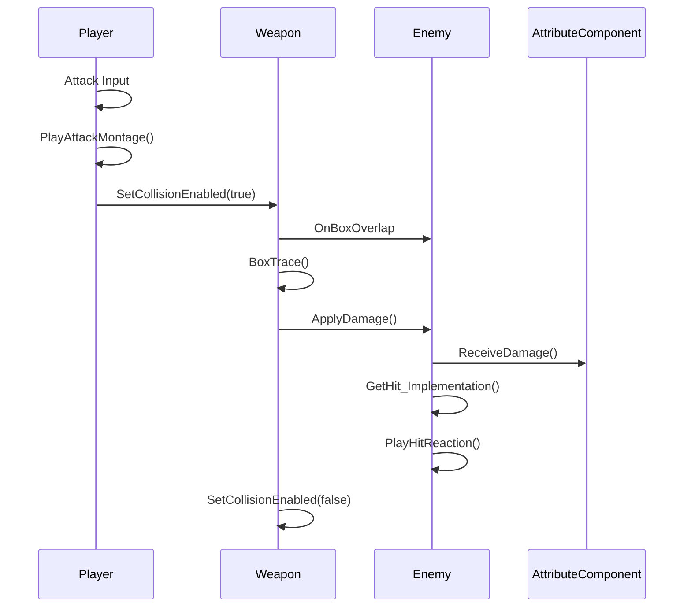
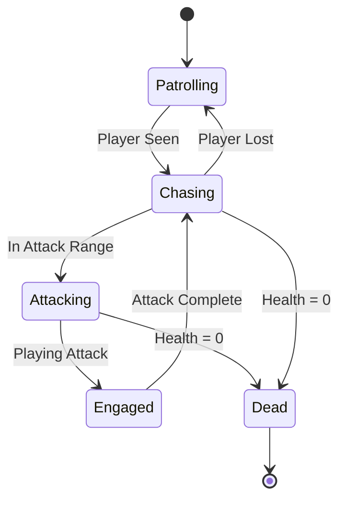

# Steel and Shadow

A third-person action RPG built with Unreal Engine 5, featuring combat mechanics, AI-driven enemies, and RPG progression systems.


## 📋 Table of Contents

- [Overview](#overview)
- [Features](#features)
- [Architecture](#architecture)
- [Core Systems](#core-systems)
- [Code Structure](#code-structure)
- [Best Practices](#best-practices)
- [Setup](#setup)
- [Controls](#controls)

## 🎮 Overview

Steel and Shadow is an action RPG that combines souls-like combat mechanics with character progression systems. Players engage in skill-based combat against AI enemies, collect resources, and progress through challenging encounters.

## ✨ Features

### Gameplay
- **Combat System**: Real-time melee combat with combo attacks and hit reactions
- **Dodge Mechanics**: Stamina-based dodging system with invulnerability frames
- **AI Enemies**: Intelligent enemy behavior with patrol, chase, and attack states
- **Character Progression**: Soul and gold collection system
- **Environmental Interaction**: Breakable objects that drop treasure
- **Weapon System**: Equip/unequip mechanics with multiple weapon types

### Technical Features
- **Inverse Kinematics**: Advanced character animation with IK for realistic foot placement
- **Landscape System**: Hand-crafted environments using foliage painting tools
- **Animation Blending**: Smooth state-based animation transitions
- **UI System**: Custom HUD with health, stamina, and resource displays
- **AI Navigation**: NavMesh-based pathfinding for enemy movement
- **Hit Detection**: Box trace-based weapon collision system

## 🏗️ Architecture

### Design Pattern: Component-Based Architecture

The project follows Unreal Engine's component-based architecture with a clear separation of concerns:

```
┌─────────────────────────────────────────────────────────────┐
│                     Game Architecture                        │
├─────────────────────────────────────────────────────────────┤
│                                                               │
│  ┌──────────────┐      ┌──────────────┐                    │
│  │   Characters │      │    Items     │                    │
│  │              │      │              │                    │
│  │ ┌──────────┐ │      │ ┌──────────┐ │                    │
│  │ │   Base   │ │      │ │   Base   │ │                    │
│  │ │Character │ │      │ │   Item   │ │                    │
│  │ └────┬─────┘ │      │ └────┬─────┘ │                    │
│  │      │       │      │      │       │                    │
│  │ ┌────┴─────┐ │      │ ┌────┴─────┐ │                    │
│  │ │  Slash   │ │      │ │  Weapon  │ │                    │
│  │ │Character │ │      │ │  Soul    │ │                    │
│  │ │  Enemy   │ │      │ │ Treasure │ │                    │
│  │ └──────────┘ │      │ └──────────┘ │                    │
│  └──────────────┘      └──────────────┘                    │
│                                                               │
│  ┌──────────────┐      ┌──────────────┐                    │
│  │  Components  │      │  Interfaces  │                    │
│  │              │      │              │                    │
│  │ - Attributes │      │ - Hit        │                    │
│  │ - HealthBar  │      │ - Pickup     │                    │
│  │ - Movement   │      │              │                    │
│  └──────────────┘      └──────────────┘                    │
│                                                               │
│  ┌──────────────────────────────────────┐                   │
│  │          HUD/UI System                │                   │
│  │                                        │                   │
│  │  SlashHUD → SlashOverlay              │                   │
│  │           → HealthBar                 │                   │
│  └──────────────────────────────────────┘                   │
└─────────────────────────────────────────────────────────────┘
```

### Class Hierarchy



## 🎯 Core Systems

### 1. Character System

**Base Character** (`ABaseCharacter`)
- Foundation for all character types
- Handles core combat mechanics
- Manages hit reactions and death states
- Implements directional hit detection

```cpp
// Key Features:
- Animation montage system
- Weapon collision management
- Damage handling
- Motion warping for attacks
```

**Player Character** (`ASlashCharacter`)
- Extends base character with player-specific features
- Input handling and movement
- Equipment system
- Resource management (health, stamina)

**Enemy AI** (`AEnemy`)
- State machine-based behavior (Patrolling, Chasing, Attacking)
- Pawn sensing for player detection
- Dynamic patrol system with multiple targets
- Combat engagement logic

### 2. Combat System

#### Attack Flow
```
Player Input → Attack() → PlayAttackMontage() 
    ↓
Animation Notify → SetWeaponCollisionEnabled(true)
    ↓
Weapon Box Overlap → BoxTrace() → ApplyDamage()
    ↓
Target GetHit() → PlayHitReaction() / Die()
```

#### Damage Calculation
```cpp
// Weapon.cpp
UGameplayStatics::ApplyDamage(
    BoxHit.GetActor(),
    Damage,
    GetInstigator()->GetController(),
    this,
    UDamageType::StaticClass()
);
```

### 3. Attribute System

The `UAttributeComponent` manages character statistics:

- **Health**: Character vitality with min/max values
- **Stamina**: Resource for dodging with regeneration
- **Gold**: Currency collection
- **Souls**: Experience/progression system

```cpp
// Key Methods:
- RegenStamina(DeltaTime)
- ReceiveDamage(Damage)
- UseStamina(Cost)
- GetHealthPercent() / GetStaminaPercent()
```

### 4. AI System

#### Enemy States
```
EEnemyState::EES_Patrolling  → Wandering between patrol points
EEnemyState::EES_Chasing     → Pursuing player
EEnemyState::EES_Attacking   → In combat
EEnemyState::EES_Engaged     → Executing attack
EEnemyState::EES_Dead        → Defeated
```

#### AI Decision Tree


### 5. Item & Pickup System

**Interface-Based Design**
- `IPickupInterface`: Defines pickup behavior
- `IHitInterface`: Defines damage reception

**Item Types**
- **Weapons**: Equippable combat items
- **Souls**: Experience orbs with drift behavior
- **Treasure**: Gold collectibles
- **Breakable Actors**: Environmental objects that spawn items

### 6. UI System

**HUD Architecture**
```
ASlashHUD (Main HUD)
    └── USlashOverlay (Widget)
        ├── Health Progress Bar
        ├── Stamina Progress Bar
        ├── Gold Counter
        └── Souls Counter

UHealthBarComponent (Enemy Health)
    └── UHealthBar (Widget)
        └── Health Progress Bar
```

**Update Flow**
```cpp
// Example: Health Update
Character->TakeDamage() 
    → HandleDamage() 
    → Attributes->ReceiveDamage()
    → SetHUDHealth() 
    → SlashOverlay->SetHealthBarPercent()
```

## 📁 Code Structure

```
SteelAndShadow/
├── Source/
│   └── SteelAndShadow/
│       ├── Public/
│       │   ├── Characters/
│       │   │   ├── BaseCharacter.h
│       │   │   ├── SlashCharacter.h
│       │   │   ├── SlashAnimInstance.h
│       │   │   └── CharacterTypes.h (Enums)
│       │   ├── Enemy/
│       │   │   └── Enemy.h
│       │   ├── Components/
│       │   │   └── AttributeComponent.h
│       │   ├── Items/
│       │   │   ├── Item.h
│       │   │   ├── Soul.h
│       │   │   ├── Treasure.h
│       │   │   └── Weapons/
│       │   │       └── Weapon.h
│       │   ├── Interfaces/
│       │   │   ├── HitInterface.h
│       │   │   └── PickupInterface.h
│       │   ├── HUD/
│       │   │   ├── SlashHUD.h
│       │   │   ├── SlashOverlay.h
│       │   │   ├── HealthBar.h
│       │   │   └── HealthBarComponent.h
│       │   └── Breakable/
│       │       └── BreakableActor.h
│       ├── Private/
│       │   └── [Implementation files matching Public structure]
│       ├── DebugMacros.h (Utility macros)
│       └── SteelAndShadow.Build.cs
```

### Module Dependencies

```cpp
PublicDependencyModuleNames.AddRange(new string[] { 
    "Core",                      // Core engine functionality
    "CoreUObject",               // Object system
    "Engine",                    // Main engine
    "InputCore",                 // Input handling
    "HairStrandsCore",           // Hair/groom rendering
    "Niagara",                   // VFX system
    "GeometryCollectionEngine",  // Destruction system
    "UMG",                       // UI widgets
    "AIModule"                   // AI navigation
});
```

## 💡 Best Practices Implemented

### 1. SOLID Principles

**Single Responsibility**
- Each class has one clear purpose
- Components handle specific functionality (AttributeComponent for stats)

**Interface Segregation**
- Separate interfaces for different behaviors (IHitInterface, IPickupInterface)
- Characters implement only needed interfaces

**Dependency Inversion**
- Code depends on interfaces, not concrete classes
- Weapons interact with any IHitInterface implementation

### 2. Unreal Engine Best Practices

**Blueprint Callable Functions**
```cpp
UFUNCTION(BlueprintCallable)
void AttachWeaponToHand();
```
- Exposes C++ functionality to blueprints
- Enables designer iteration

**Property Specifiers**
```cpp
UPROPERTY(EditAnywhere, Category = Combat)
float AttackRadius = 150.f;

UPROPERTY(VisibleAnywhere, BlueprintReadOnly)
UAttributeComponent* Attributes;
```
- `EditAnywhere`: Editable in editor
- `VisibleAnywhere`: Visible but not editable
- `BlueprintReadOnly`: Accessible in blueprints

**Forward Declarations**
```cpp
class AWeapon;  // Instead of #include
```
- Reduces compile times
- Minimizes header dependencies

### 3. Memory Management

**Component Lifecycle**
```cpp
// Constructor initialization
Attributes = CreateDefaultSubobject<UAttributeComponent>(TEXT("Attributes"));

// Proper cleanup via UPROPERTY
UPROPERTY()
class USlashOverlay* SlashOverlay;  // Garbage collected
```

**Smart Pointer Usage**
- UPROPERTY for UObject references (automatic GC)
- TArray for dynamic arrays
- No raw pointers for UObjects

### 4. Code Organization

**Debug Macros**
```cpp
#define DRAW_SPHERE(Location) 
    if (GetWorld()) 
        DrawDebugSphere(GetWorld(), Location, 25.f, 12, FColor::Red, true);
```
- Centralized debug visualization
- Conditional compilation support
- Easy to enable/disable

**State Enums**
```cpp
UENUM(BlueprintType)
enum class EActionState : uint8
{
    EAS_Unoccupied,
    EAS_HitReaction,
    EAS_Attacking,
    // ...
};
```
- Type-safe state management
- Blueprint accessible

### 5. Animation Integration

**Anim Notifies**
- Enable/disable weapon collision during attacks
- Trigger sound effects
- Spawn particle effects

**Motion Warping**
```cpp
FVector ABaseCharacter::GetTranslationWarpTarget()
{
    const FVector TargetLocation = CombatTarget->GetActorLocation();
    FVector TargetToMe = (GetActorLocation() - TargetLocation).GetSafeNormal();
    return TargetLocation + (TargetToMe * WarpTargetDistance);
}
```
- Dynamic character positioning
- Smooth combat engagement

### 6. Performance Optimization

**Tick Optimization**
```cpp
PrimaryActorTick.bCanEverTick = false;  // Disable when not needed
```

**Collision Optimization**
```cpp
// Ignore unnecessary channels
GetMesh()->SetCollisionResponseToChannel(
    ECC_Camera, 
    ECR_Ignore
);
```

**Smart State Checking**
```cpp
if (IsDead()) return;  // Early exit pattern
```

## 🛠️ Setup

### Prerequisites
- Unreal Engine 5.x
- Visual Studio 2022 (or compatible IDE)
- C++17 support

### Installation

1. Clone the repository:
```bash
git clone https://github.com/yourusername/steel-and-shadow.git
cd steel-and-shadow
```

2. Generate project files:
```bash
Right-click SteelAndShadow.uproject → Generate Visual Studio project files
```

3. Open `SteelAndShadow.sln` in Visual Studio

4. Build the solution (Development Editor configuration)

5. Launch the project from Unreal Engine Editor

### Project Structure Setup

1. **Content Browser Organization**
   - Blueprints/Characters
   - Blueprints/Enemies
   - Blueprints/Items
   - Blueprints/UI
   - Maps
   - Materials
   - Meshes
   - Animations

2. **Required Assets** (Not included)
   - Character meshes and animations
   - Enemy meshes and animations
   - Weapon meshes
   - UI textures
   - Sound effects
   - Particle effects (Niagara)

## 🎮 Controls

| Action | Key/Button |
|--------|------------|
| Move Forward/Back | W/S |
| Move Left/Right | A/D |
| Camera Look | Mouse |
| Jump | Spacebar |
| Attack | Left Mouse Button |
| Dodge | Right Mouse Button |
| Equip/Unequip Weapon | E |

## 🎨 Technical Highlights

### Inverse Kinematics System
- Custom IK implementation for realistic foot placement
- Dynamic terrain adaptation
- Smooth blending between IK and base animations

### Landscape & Environment
- Hand-crafted landscapes using Unreal's terrain tools
- Foliage painting for vegetation distribution
- Optimized LOD settings for performance
- Procedural placement with manual refinement

### Animation System
- State machine-based animation blueprint
- Directional hit reactions (Front, Back, Left, Right)
- Multiple death animations with pose selection
- Smooth locomotion blending

### Combat Mechanics
- Box trace weapon collision (more precise than sphere)
- Ignore list to prevent multi-hits per swing
- Damage type system for future expansion
- Directional attack warping

## 📊 System Diagrams

### Combat Flow


### Enemy AI State Machine


## 🔮 Future Enhancements

- [ ] Multiplayer support
- [ ] Additional weapon types (bows, magic)
- [ ] Skill tree system
- [ ] Quest system
- [ ] Save/Load functionality
- [ ] Boss encounters
- [ ] Level progression
- [ ] Inventory system

## 📝 License

This project is licensed under the MIT License - see the LICENSE file for details.

## 🤝 Contributing

Contributions are welcome! Please feel free to submit a Pull Request.

## 📧 Contact

Your Name - [your.email@example.com](mailto:your.email@example.com)

Project Link: [https://github.com/yourusername/steel-and-shadow](https://github.com/yourusername/steel-and-shadow)

---

**Note**: This is an educational project demonstrating advanced Unreal Engine C++ programming techniques, game architecture, and best practices for action RPG development.
